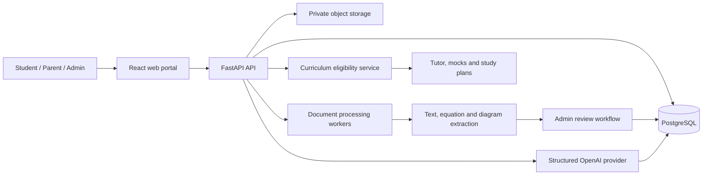

# AKURU

AKURU is a family learning and exam-preparation platform for Pearson Edexcel learners. It is designed to turn reviewed textbooks, past papers, marking schemes, and examiner reports into curriculum-aware practice, mock papers, feedback, and study plans.

Phase 1 focuses on iGCSE students in Grades 10 and 11. The supported subjects are English, Maths, ICT, Biology, Chemistry, Physics, French, and Human Biology.

## What AKURU is designed to do

- Give Admins control over accounts, enrolments, source documents, textbook units, and curriculum coverage.
- Keep each family's children, submissions, reviews, and progress isolated.
- Track a student's cumulative Grade and Term progression.
- Select mock-paper questions only when every mapped textbook unit has been covered.
- Preserve equations, diagrams, illustrations, and source provenance as the document pipeline is developed.
- Support role-specific Student, Parent, and Admin portals.

## Current status

| Area | Status |
| --- | --- |
| React portal and role-specific screens | Working locally |
| FastAPI application and PostgreSQL schema | Implemented |
| Argon2 authentication, revocable sessions, CSRF, and login throttling | Implemented |
| Frontend authentication and account administration through FastAPI | Implemented |
| Remaining frontend-to-FastAPI feature integration | In progress |
| Deterministic PDF/OCR/equation/diagram extraction | Implemented; Admin review required |
| Versioned textbook-unit review and publication | Implemented |
| Structured OpenAI provider, prompts, limits, and invocation audit | Implemented; disabled by default |
| RAG tutor, AI assessment, and generated media workflows | Planned |
| Public production release | Blocked on frontend/FastAPI integration and production hardening |

The frontend no longer contains mock users or an active mock API. Document, coverage, question, practice, assessment, and review endpoints are still being moved to FastAPI.

## Architecture



The detailed domain rules are in [the overall architecture](source-code/docs/architecture.md). Implementation notes are in the [frontend documentation](source-code/frontend/docs/architecture.md) and [backend documentation](source-code/backend/docs/architecture.md).

## Repository layout

```text
.
├── source-code/
│   ├── frontend/              React, TypeScript and Vite/Vinext portal
│   ├── backend/               FastAPI, SQLAlchemy, Alembic and PostgreSQL tests
│   ├── docs/                  Shared architecture and verification notes
│   ├── scripts/               Local frontend/backend launchers
│   └── package.json           Combined developer commands
└── user-docs/                 Admin, Parent and Student guides
```

## Local development

### Prerequisites

- Node.js 22.13 or newer
- npm
- Python 3.12 or newer
- PostgreSQL 15 or newer, listening locally on port 5432
- A PostgreSQL user allowed to create the development database, or a pre-created `akuru` database

### Clone and install the frontend

```bash
git clone git@github.com:sudeeram/akuru.git
cd akuru/source-code/frontend
npm ci
```

Frontend packages are installed only inside `frontend/node_modules`.

### Configure and install the backend

```bash
cd ../backend
cp .env.example .env
```

Edit `.env` with the local PostgreSQL connection. Never commit this file. Then create an isolated Python environment and install the backend packages:

```bash
python3 -m venv .venv
.venv/bin/python -m pip install -r requirements-dev.txt
.venv/bin/python -m app.bootstrap_database
.venv/bin/python -m alembic upgrade head
```

AI is disabled by default, so local setup and tests do not require an OpenAI key or make paid calls. Follow the [Step 5 AI provider guide](source-code/backend/docs/step-05-ai-provider.md) and [Step 5A account-routing guide](source-code/backend/docs/step-05a-ai-account-routing.md) when you are ready to configure backend-only keys and models.

Create the first Admin interactively. The password is read without echoing and is stored only as an Argon2 hash:

```bash
.venv/bin/python -m app.bootstrap_admin \
  --username admin \
  --name "AKURU Administrator"
```

### Run locally

Open separate terminals in `source-code`.

Frontend, with `/api/v1` proxied to FastAPI:

```bash
npm run dev
```

FastAPI on `http://127.0.0.1:8000`:

```bash
npm run backend:dev
```

The direct Python equivalent is:

```bash
cd backend
.venv/bin/python -m uvicorn app.main:app \
  --reload --host 127.0.0.1 --port 8000
```

Development API documentation is available at `http://127.0.0.1:8000/docs`.

### Test and validate

Run from `source-code`:

```bash
npm test
npm run typecheck
npm run lint
npm run build
```

`npm test` runs the frontend suite and PostgreSQL-backed backend tests. Backend test writes are transactionally rolled back.

Check migration consistency directly:

```bash
cd backend
.venv/bin/python -m alembic check
```

## Database migrations

Change SQLAlchemy models and generate a migration rather than creating tables during application startup:

```bash
cd source-code/backend
.venv/bin/python -m alembic revision --autogenerate -m "describe the change"
.venv/bin/python -m alembic upgrade head
```

Review generated migrations before committing them. Back up production PostgreSQL before applying a schema change.

## Production installation target

The recommended first deployment is an Ubuntu LTS Oracle Cloud instance with PostgreSQL kept on a private interface, Nginx or another reverse proxy terminating HTTPS, and the application running as an unprivileged service account. Oracle Linux is also viable, but the package names and service commands will differ.

For Ubuntu, use the repository's [installation playbook](deploy/ubuntu/README.md). It provides repeatable prerequisite and service installers, hardened Nginx/TLS configuration, systemd isolation, Redis/PostgreSQL checks, privacy retention, encrypted backups and verification for Ubuntu 24.04 LTS.

### 1. Prepare the server

Install these through the operating system's package management and your approved Node.js source:

- Git
- Python 3.12+, `venv`, and build support
- Node.js 22.13+ and npm
- PostgreSQL and Redis
- Nginx and TLS tooling
- Poppler and Tesseract for the document-extraction pipeline

Create an unprivileged `akuru` service account and deploy the repository under a path such as `/opt/akuru`. Do not run the application as `root`.

### 2. Prepare PostgreSQL

Use a dedicated application role rather than the PostgreSQL administrator account:

```sql
CREATE ROLE akuru_app LOGIN PASSWORD 'use-a-generated-secret';
CREATE DATABASE akuru OWNER akuru_app;
REVOKE ALL ON DATABASE akuru FROM PUBLIC;
```

Restrict port 5432 with the OCI network security list, host firewall, and PostgreSQL rules. Only the application host and administrative backup path should reach it.

### 3. Install the backend

```bash
cd /opt/akuru/source-code/backend
python3 -m venv .venv
.venv/bin/python -m pip install --upgrade pip
.venv/bin/python -m pip install -r requirements.txt
```

Create `/etc/akuru/akuru.env` outside the checkout, owned by `root:akuru` with mode `0640`:

```dotenv
AKURU_ENVIRONMENT=production
AKURU_DATABASE_HOST=127.0.0.1
AKURU_DATABASE_PORT=5432
AKURU_DATABASE_NAME=akuru
AKURU_DATABASE_USER=akuru_app
AKURU_DATABASE_PASSWORD='use-a-generated-secret'
AKURU_CORS_ORIGINS='["https://akuru.example.com"]'
AKURU_ALLOWED_HOSTS='["akuru.example.com"]'
AKURU_COOKIE_SECURE=true
AKURU_OPERATIONS_TOKEN='use-a-generated-random-secret'
```

Apply migrations and create the first Admin:

```bash
.venv/bin/python -m alembic upgrade head
.venv/bin/python -m app.bootstrap_admin \
  --username admin \
  --name "AKURU Administrator"
```

### 4. Run FastAPI as a service

Use a process supervisor such as systemd. A representative unit is:

```ini
[Unit]
Description=AKURU FastAPI service
After=network-online.target

[Service]
User=akuru
Group=akuru
WorkingDirectory=/opt/akuru/source-code/backend
ExecStart=/opt/akuru/source-code/backend/.venv/bin/python -m uvicorn app.main:app --host 127.0.0.1 --port 8000 --workers 2 --proxy-headers --forwarded-allow-ips=127.0.0.1
Restart=on-failure
PrivateTmp=true
NoNewPrivileges=true

[Install]
WantedBy=multi-user.target
```

Keep Uvicorn bound to loopback. Configure Nginx to proxy HTTPS API requests to `127.0.0.1:8000`, preserve the original host, and replace forwarded-client headers. Expose only ports 80 and 443 publicly, redirect HTTP to HTTPS, and use a valid TLS certificate.

### 5. Frontend production gate

Before exposing the web portal publicly:

1. Implement the remaining feature routes in FastAPI.
2. Remove the temporary local server from the production start path.
3. Verify Admin, Parent, and Student authorization against PostgreSQL.
4. Run browser-level tests through the HTTPS reverse proxy.
5. Confirm secure cookies, CSRF behavior, file authorization, upload limits, audit logging, backups, and restore procedures.

Until these items are complete, use the frontend only for local development and interface review.

## Security model

- Functional FastAPI routes require an active database-backed session.
- Session cookies are HttpOnly and SameSite Strict; production requires Secure cookies over HTTPS.
- State-changing authenticated requests require a matching CSRF header.
- Passwords use Argon2 and are never returned by APIs.
- Login failures are persisted and throttled.
- Admin-only actions and family ownership must be enforced in backend queries, independent of the UI.
- `.env`, local databases, uploaded files, virtual environments, and `node_modules` are excluded from Git.
- `/health` intentionally returns only constant liveness information. Production OpenAPI documentation is disabled.

Review [backend security details](source-code/backend/README.md#authentication-security) before deployment.

## Documentation

- [Overall architecture](source-code/docs/architecture.md)
- [Frontend architecture](source-code/frontend/docs/architecture.md)
- [Backend architecture and security](source-code/backend/docs/architecture.md)
- [Ubuntu installation playbook](deploy/ubuntu/README.md)
- [Admin guide](user-docs/ADMIN-GUIDE.txt)
- [Parent guide](user-docs/PARENT-GUIDE.txt)
- [Student guide](user-docs/STUDENT-GUIDE.txt)
- [Data and safety guide](user-docs/DATA-AND-SAFETY.txt)

## Contributing

Create a branch for each change, include the related Alembic migration when the data model changes, and run the complete validation commands before opening a pull request. Do not commit credentials, source exam documents, student data, or generated local storage.
