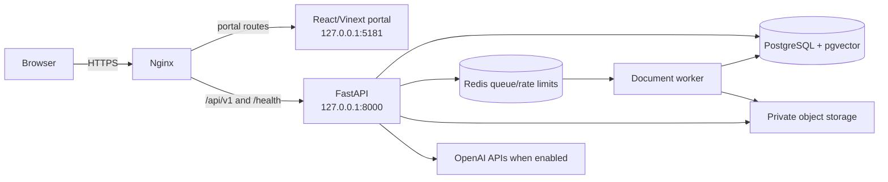

# System architecture

## Runtime topology



Locally, Vinext runs on `127.0.0.1:5180` and proxies `/api/v1` to FastAPI on port `8000`. The built preview uses port `5181`. In production, only Nginx is public. FastAPI, the portal, PostgreSQL and Redis listen on loopback.

## Repository layout

```text
project root/
├── developer-docs/          This handbook
├── user-docs/               Admin, Parent and Student guides
├── deploy/ubuntu/           Production playbook and service definitions
└── source-code/
    ├── backend/             FastAPI application, worker, models and migrations
    │   ├── app/api/v1/      HTTP adapters
    │   ├── app/schemas/     Pydantic request/response contracts
    │   ├── app/services/    Domain workflows and transaction rules
    │   ├── app/ai/          AI providers, routing and prompts
    │   ├── app/storage/     Local and OCI object-storage adapters
    │   ├── migrations/      Forward Alembic migrations
    │   └── tests/           Unit, integration and schema tests
    ├── frontend/            React 19, TypeScript, Vite/Vinext portal
    │   ├── app/             Route entry points and global styles
    │   ├── features/        Role and domain feature modules
    │   ├── components/ui/   Shared UI primitives
    │   ├── lib/             API boundary and generated contract
    │   ├── public/          AKURU BOT and static assets
    │   └── tests/           Frontend contract/behavior tests
    ├── scripts/             Root command adapters
    ├── docs/                Cross-cutting architecture and environment records
    └── todo/                Prioritized delivery plans
```

Deployment assets live at repository root in `deploy/ubuntu`; user documentation lives in `user-docs`.

## Request flow

1. The browser sends a same-origin request through `frontend/lib/api.ts`.
2. Nginx routes `/api/v1/*` to FastAPI.
3. Middleware validates host, origin, body size and request rate.
4. A route dependency resolves the opaque session and role; mutations also validate CSRF.
5. The route validates the Pydantic request and calls a domain service.
6. The service checks ownership, lifecycle and subject/course constraints and performs the transaction.
7. Repositories provide reusable scoped queries where a dedicated query boundary is useful.
8. A response schema prevents accidental exposure of internal or secret fields.
9. Errors use a structured envelope that the frontend turns into actionable messages.

## Main domains

- Identity: Admin, Parent and Student accounts, family links, enrolments and progression.
- Curriculum: iGCSE subjects, Grade 10/11, Term 1–3 and cumulative coverage.
- Content: textbooks, Unit/Module groups, topics, document versions, extraction review and publication.
- Assessment: official materials, topic mapping, immutable exams, answers, marking and review.
- Learning: retrieval, mastery, weaknesses, study plans, flashcards and media.
- Tutor: profiles, sessions, learner context, citations, guided practice, transcripts, safety and voice.
- Operations: AI accounts, release gates, audit events, quotas, retention, health and backups.

## Trust boundaries

The browser is untrusted. IDs, roles, coverage, marks and publication states received from it are only requested operations. Domain services reload authoritative records and verify relationships. Redis transports job identifiers but is not authoritative. Private storage holds bytes; PostgreSQL holds ownership, checksums, lifecycle and provenance. AI output is untrusted structured input until server validation and the applicable review gate succeed.
