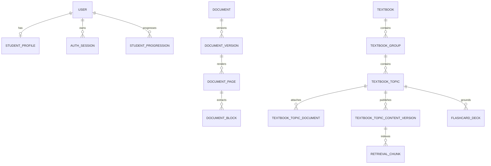

# Data and content lifecycle

## PostgreSQL and migrations

SQLAlchemy models in `backend/app/models.py` define the runtime relational model. Alembic migrations under `backend/migrations/versions` define how an existing environment reaches it. The current production path begins at the consolidated `0001_initial_akuru_schema` baseline and advances only through reviewed forward migrations.

Never delete or recreate a populated database for a routine feature. Prefer additive migrations, prove them on disposable databases, run `alembic check`, take encrypted production backups, and apply them through the release script.

UUID primary keys are internal. Stable `public_ref` values identify many textbook, Tutor and content resources in APIs and user-visible links.

## Core relationships



The actual model contains additional assessment, mastery, Tutor, audit, quota and evaluation tables. Read the model and latest migrations before changing a relationship.

## Textbook hierarchy

The current hierarchy is:

```text
Textbook -> Unit or Module group -> Topic -> attached document versions
```

A topic may publish independently. Adding later topics does not change the stable identity of an existing published topic. Course and subject are inherited and validated; a Chemistry source cannot be attached to a Mathematics topic.

Attached sources have roles:

- `primary`: canonical text used for readiness, publication and retrieval;
- `supporting`: explicitly included distinct supporting text;
- `reference`: explicitly included reference text;
- `visual_reference`: provenance and selectable visual assets; its OCR text is excluded from ordinary retrieval.

Exactly selected and approved visual assets enter a published topic version with document/version/checksum/page/bounding-box provenance and accessible text. A selected but unapproved visual blocks publication.

## Document lifecycle

1. Admin uploads a supported private file.
2. AKURU validates signature, size, subject prerequisites and malware policy.
3. The original receives a checksum and immutable version record.
4. Redis carries the job ID to the worker.
5. The worker preflights, renders pages, extracts native text/OCR, reading order, equations, tables and visual assets.
6. Low-confidence or structurally important pages/blocks remain review tasks.
7. Admin corrections update review evidence; completion synchronizes document, version and active topic attachment readiness.
8. A separate explicit operation publishes immutable topic content.

Storage bytes are private. Database rows provide authorization, ownership and evidence. Local storage defaults outside the checkout at `/data/akuru/documents`; OCI storage is optional.

## Retrieval and citations

Only reviewed, published, authorized topic content produces active retrieval chunks. pgvector stores 256-dimensional embeddings. Queries are filtered by Student access, course, subject and eligible topics before relevance ranking. Exact source metadata is retained so Tutor and learning features can cite the approved document and page.

Duplicate source text must not create repeated active evidence. Visual-reference OCR is deliberately excluded while approved visuals retain their own provenance.

## Curriculum and assessment snapshots

Coverage is versioned by course, subject, grade and term. Student eligibility is cumulative across recorded progression periods. Mock-paper selection requires every topic mapped to a question to be covered.

Starting an assessment freezes question versions, coverage, rubric, ordering, sources and deadlines. Later curriculum or question changes affect new sessions only. Assessment result revisions retain prior versions and reviewer provenance.

## Publication rule

Publication is a domain transition, not a boolean edited by the client. Services verify review completion, source availability, exact versions, subject ownership, evidence, duplicate protection and any applicable evaluation gate inside the publication transaction.
