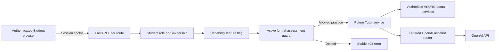

# Tutor Step 0 — Foundation and assessment boundaries

Tutor Step 0 establishes the server controls that later text, tool and voice endpoints must use. It adds no provider call and exposes no tutor conversation feature.

## Verification baseline

The baseline recorded on 14 September 2026 from `source-code/` is:

- generated OpenAPI contract: current;
- frontend tests: 23 passed;
- backend tests: 79 passed;
- frontend TypeScript: passed;
- frontend lint: passed; and
- production frontend build: passed.

The complete baseline command is:

```bash
npm run verify
```

## Existing services the Tutor Agent will reuse

| Tutor need | Existing authoritative implementation |
| --- | --- |
| Authenticated student and role | `app/security.py`, `app/permissions.py` and authentication services |
| Student enrolment and family ownership | student repository, account service and portal service |
| Grade + Term progression and covered units | `app/services/curriculum_plans.py` |
| Eligible questions and immutable attempts | `app/services/assessments.py` |
| Official marking and improved answers | `app/services/assessment_marking.py` and subject marking policies |
| Explainable unit mastery | `app/services/mastery.py` |
| Recurring weaknesses | `app/services/weaknesses.py` |
| Adaptive plans | `app/services/study_plans.py` |
| Approved textbook evidence | `app/services/retrieval.py` and embeddings service |
| Diagrams and illustrations | `app/services/media.py` |
| OpenAI selection and failover | `app/ai/router.py`, provider adapters and `app/services/ai_accounts.py` |
| Provider request/token budgets | `app/services/usage_limits.py` |
| Audit, retention and operational review | operations, retention and audit models/services |

The Tutor Agent calls these services through narrow application boundaries. It does not reimplement eligibility, marking, mastery, retrieval authorization, provider routing or family scoping.

## Assessment policy

`app/schemas/assessments.py` is the canonical assessment-mode vocabulary:

- `practice` permits learning assistance;
- `mock` is a formal assessment; and
- `official_paper` is a formal assessment.

`app/services/assessment_access.py` classifies those modes and fails closed for unknown future values. Existing assessment hints now use its practice-only guard. Future text, voice and tutor-tool endpoints must call `require_tutor_access` before provider, retrieval or session work.

The guard first checks the relevant release flag and then looks for an active, unexpired formal assessment owned by the authenticated student. While one exists, text, voice and tutor tools return `tutor_disabled_during_formal_assessment`. Client-side hiding is only presentation; FastAPI owns enforcement.

`GET /api/v1/tutoring/capabilities` is authenticated and Student-only. It reports effective text, voice and tool availability plus `formal_assessment_active` when the formal-assessment guard is active. It returns no provider key, account alias, internal assessment identifier or other student's data.

## Feature flags

The following backend-only settings default to `false`, including in production:

```dotenv
AKURU_TUTOR_TEXT_ENABLED=false
AKURU_TUTOR_VOICE_ENABLED=false
AKURU_TUTOR_TOOLS_ENABLED=false
```

Each flag is an independent release control. Enabling one does not override the formal-assessment guard. Production rollout must keep a feature disabled until its corresponding evaluation gate passes.

## Data flow and threat boundaries



- The browser never receives permanent OpenAI credentials. Realtime voice will use a short-lived credential added in Tutor Step 10.
- Tutor routes derive student identity from the authenticated principal. A client-supplied student reference cannot expand access.
- Feature flags control release, not authorization. Role, ownership, curriculum and source checks still run when enabled.
- Provider output cannot authorize a source, assessment, unit or student action.
- Source material and student messages remain untrusted input and cannot redefine tool permissions.
- The current global `Permissions-Policy` disables microphone access. Tutor Step 10 must deliberately enable it only for the same-origin voice interface after its voice security tests pass.

## Verification added by this step

Focused tests verify that:

- only `practice` permits assessment assistance;
- `mock` and `official_paper` are always formal;
- unknown future modes fail closed;
- all Tutor flags default to disabled;
- every enabled Tutor capability is denied during a live formal assessment; and
- enabled capabilities are available when no formal attempt is active.
