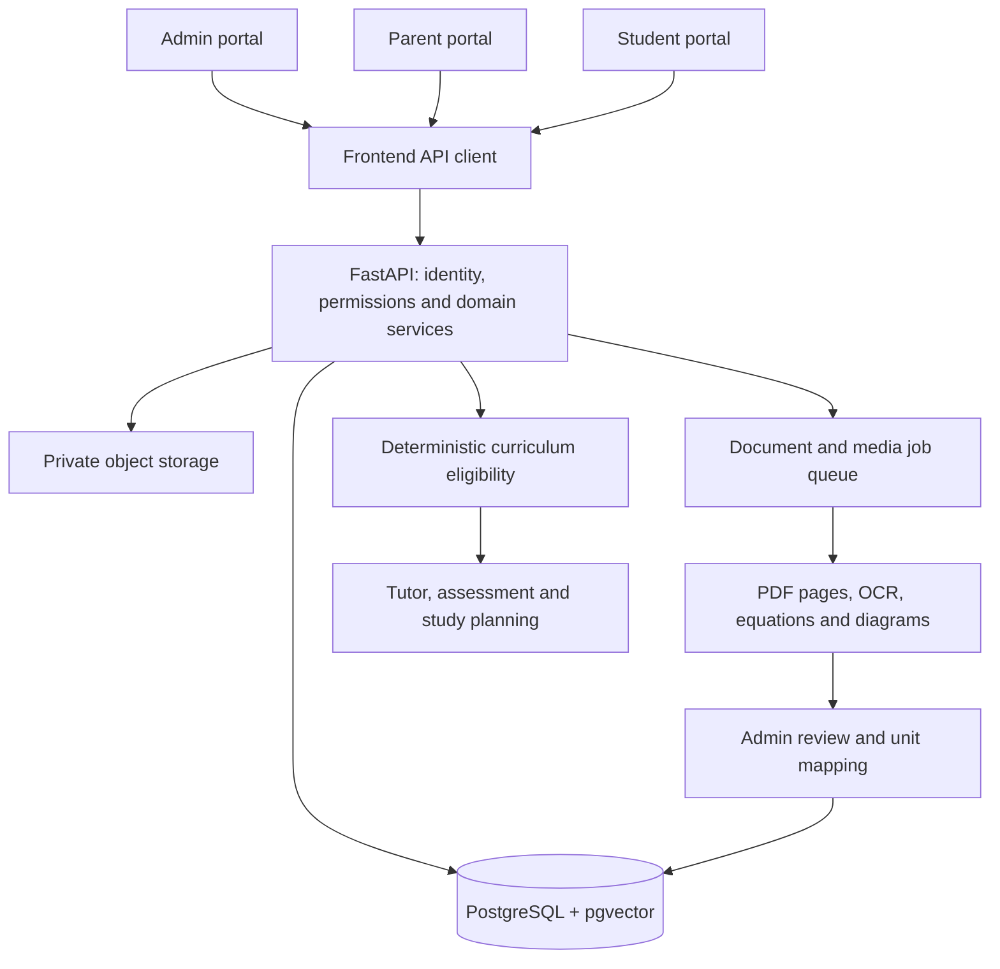

# AKURU overall architecture

Status: authoritative Phase 1 domain specification, with the frontend connected to a FastAPI/PostgreSQL identity, account and enrolment foundation. This document supersedes the earlier parent-managed, mixed-qualification demo design. The textbook-topic update is tracked in [its implementation roadmap](../todo/ongoing/TODO-TEXTBOOK-TOPICS.md). Implementation details belong in [frontend architecture](../frontend/docs/architecture.md) and [backend architecture](../backend/docs/architecture.md).

## Repository boundaries

One repository contains two application folders. No additional repository is required.

```text
source-code/
  docs/architecture.md           Shared domain rules and system boundaries
  frontend/                     React/TypeScript application
    app/                        Portal shell and role navigation
    features/                   Admin, Parent and Student screens
    api/                        Domain API operations, types and public barrel
      core/client.ts            Shared frontend HTTP boundary
    tests/                      Frontend boundary tests
    docs/architecture.md        Frontend implementation and API contract
  backend/
    docs/architecture.md        FastAPI design and implementation requirements
    README.md                   Backend setup, authentication and deployment notes
  scripts/run-web.mjs           Existing local frontend launcher
```

The browser uses same-origin `/api/v1/*` routes. Vite proxies that prefix to FastAPI during development; the production reverse proxy owns the same route. The frontend must never hold provider API keys or implement authoritative permissions.

## System layout



FastAPI authentication, account administration, document processing, approved retrieval, deterministic eligibility, immutable assessment delivery, AI assessment, explainable unit mastery, weakness diagnosis and adaptive study planning are implemented.

## Roles and family ownership

| Action | Admin | Parent | Student |
| --- | --- | --- | --- |
| Create parent accounts | Yes | No | No |
| Create child accounts and link to a parent | Yes | No | No |
| Assign course, grade, term and subjects | Yes | No | No |
| Upload and approve learning documents | Yes | No | No |
| Define textbook units and term coverage | Yes | No | No |
| Map and approve paper questions | Yes | No | No |
| View student records | All, audited in production | Own children only | Own records only |
| Review answers and create practice assignments | Administrative access as required in production | Own children only | No |
| Submit practice/exams | No | No | Own account only |
| Upload answer working | No learning-work impersonation | No | Own submission attachments only |

A parent has zero or more children. Each child belongs to exactly one parent account in Phase 1. Multi-guardian access is a future explicit schema change, not implied by the Parent role. An Admin must create the parent first. Parent role alone does not grant access to every family.

Admin-created usernames must be unique. Password hashes belong to server storage. A child's client-supplied `studentId` or `parentId` never grants ownership. Every read, mutation, attachment retrieval, review and report checks the authenticated actor. If an Admin changes a child's parent, access follows the current parent relationship; historical actor/audit information remains. Family/enrolment changes are blocked during an active mock in the local implementation.

## Mandatory Student-performance isolation

Every performance measurement belongs to one specific Student. A score, mastery state, confidence value, streak, rating history, weakness, recommendation, progress summary or similar derived measure must never be stored as a global property of a question, flashcard, topic, unit, subject or family. Shared learning content may carry reviewed properties such as intrinsic difficulty, marks or category; demonstrated performance always includes the Student identity as part of its ownership and uniqueness boundary.

For flashcards, intrinsic difficulty belongs to the immutable card version, while mastery belongs to the combination of Student and immutable card version. Database uniqueness, service queries, caches, APIs, background jobs, exports and frontend query keys must all retain that Student boundary. A new content version does not silently inherit mastery unless an explicit reviewed equivalence and migration rule permits it. Parent access is a read-only authorization over each linked child's separate measurements and must not merge siblings. Admin aggregate reporting may calculate de-identified summaries, but those summaries never replace or mutate an individual Student's evidence.

This rule applies to every present and future AKURU performance feature, including flashcards, practice, mock exams, past papers, Tutor-guided practice, topic and unit mastery, weaknesses, recommendations and study plans. Automated tests must prove cross-Student isolation for every new measurement domain.

## Course and enrolment catalog

There are exactly three course identifiers: `iPrimary`, `iLower Secondary`, `iGCSE`. Only `iGCSE` is active in Phase 1. Other course names remain in the catalog for future implementation; Phase 1 enrolment and ingestion reject them rather than silently converting them.

iGCSE supports exactly:

- Grades: `Grade 10`, `Grade 11`.
- Terms within each grade: `Term1`, `Term2`, `Term3`.
- Subjects: English, Maths, ICT, Biology, Chemistry, Physics, French, Human Biology.

Biology, Chemistry, Physics and Human Biology are separate subjects. There is no combined `Science` subject in this Phase 1 catalog. Example references to a science paper mean a paper within its specific science subject; they never authorize cross-subject unit relationships.

A student has one active course, one current grade, one current term and one or more enrolled subjects. The student also has an ordered progression list of Grade + Term combinations already reached. For example, Grade 10 Term2 stores both Grade 10 Term1 and Grade 10 Term2. The phase-one course applies to every selected subject. The old feature allowing arbitrary qualifications per subject is superseded. Keep syllabus/specification and textbook edition identities in the production curriculum model so two specifications or editions are not accidentally mixed.

PostgreSQL stores the current enrolment and progression history. Each practice session, official paper and mock now captures the accumulated scope in an immutable assessment snapshot. Advancement is an Admin action; no automatic promotion is assumed.

## Textbooks, section groups, topics and coverage

The next content schema uses **Textbook → Section Group → Topic → Textbook Part**. This section is authoritative over older unit-only descriptions that remain as implementation history elsewhere in this document. The production database currently contains no educational content, so this hierarchy will replace the unused unit-only content model without converting learning records. Identity, authentication, family, enrolment, provider, quota, audit and operational records remain intact.

A textbook belongs to one course and one subject and has an edition, optional publisher, publication state and a `group_label` of `unit` or `module`. `section_group` is the canonical backend entity. The selected label changes user-facing wording only; it never changes authorization, retrieval, coverage or assessment rules. A section group belongs to exactly one textbook and contains ordered topics. A topic is the smallest curriculum, question-mapping, retrieval, mastery, recommendation and study-planning entity.

One or more uploaded textbook parts may support a topic. A PDF uploaded for Chemistry Topic 11 is a part of the selected logical Chemistry textbook; it must not create another textbook. Each relationship retains document version, role, sequence, physical PDF pages, editable printed-page labels and review state. Only reviewed, published topic content may produce active retrieval chunks, citations or downstream mappings. Every returned chunk retains textbook, group, topic, source document version, physical page, printed page and bounding-box provenance.

Admin assigns every published topic to the Grade + Term where it is first taught inside a versioned curriculum plan. A draft starts from the latest publication so Admin can append topics as teaching progresses. Publication makes the version immutable and supersedes the prior publication. Removing or moving previously published coverage requires an explicit impact confirmation. Each topic has one introduction period within a plan version.

Student eligibility is cumulative across the student's saved progression list. Grade 10 Term 2 contains topics introduced in Grade 10 Terms 1 and 2. Grade 11 contains earlier Grade 10 topics only when those periods exist in the student's progression. Every reached period requires explicit published coverage; missing coverage fails closed and an empty union provides no eligible questions. Existing assessments retain their immutable curriculum-plan and topic-set snapshots when a new plan is published.

Past-paper questions map to one or more published topics from the paper's approved same-subject textbook edition. A question spanning several topics is eligible only when every required topic is covered. Cross-subject and cross-edition mappings are invalid. Unit or Module mastery is an explainable aggregation of its topic mastery; authoritative evidence remains attached to the topic and source assessment.

## Document ingestion and publishing

Supported learning document types are `Textbook`, `Past paper`, `Marking scheme`, `Examiner report`, `Reference material`. Only Admin can upload them. Student answer attachments are a separate permission and do not become learning documents.

Required workflow:

1. Admin selects iGCSE and the subject, uploads the textbook and verifies its identity/edition.
2. Admin reviews the textbook and records its units. With OCR later, extracted unit proposals remain untrusted until reviewed.
3. Admin assigns the units covered in each grade and term.
4. Only after an approved same-subject textbook with registered units exists may Admin upload a past paper. Upload validates this server-side.
5. Admin uploads the matching marking scheme and examiner report linked to that past paper in the same subject/course. In production also validate session, year, paper/component, variant and specification.
6. Every question or independently usable subpart is entered/extracted with question number, marks, prompt, equations, diagrams and source page references. A subpart requiring a common stem or shared diagram must retain that dependency.
7. Every question is linked to one or more units of the selected textbook, all in the same course and subject. An empty, missing, foreign-subject or foreign-textbook mapping is invalid.
8. Admin checks the question, mapping, worked explanation and marking points. Pending questions cannot be used for study or mocks.
9. Admin confirms that the entire paper has been captured and reviewed before approving the paper. Until extraction is implemented, the manual workflow requires a completeness attestation plus at least one reviewed question; it cannot independently count questions in a PDF. The extraction pipeline must reconcile the source question inventory and subparts before publication.

Paper questions are tagged by unit, not by an artificial term assigned to the original full-syllabus paper. Marking schemes and examiner reports stay linked to their source paper and, where possible, to individual questions/subparts. A source paper may cover the whole syllabus; a student's generated term mock must still pass the covered-unit filter.

Question edits invalidate paper sign-off. Holding a textbook or paper for review removes its questions from new candidate pools. Historical attempts remain readable. Production uses immutable document/question versions and explicit publication transitions; never rewrite an exam that a student has already started or submitted.

## Mandatory term-mock selection rule

For student `s`, subject `x`, and question `q`, let `C` be the union of covered-unit sets for every saved Grade + Term progression combination for the student's current course and subject, and `U(q)` the question's required unit set.

```text
eligible(s, q) =
  active valid enrolment
  AND q.subject is enrolled by s
  AND q.course = s.course
  AND approved textbook, paper and question
  AND U(q) is non-empty
  AND every linked unit belongs to q's textbook/course/subject
  AND U(q) is a subset of C
```

Example: covered units are `{1, 2}`. A question mapped to `{1}` or `{1, 2}` is eligible. A question mapped to `{2, 3}` is excluded because Unit 3 is not covered. Overlap alone is insufficient.

Server computes the candidate pool. Clients cannot choose arbitrary question IDs or broaden scope. The local implementation applies the same rule to practice, lessons, hints, assignments and study suggestions, as well as mocks, to keep the term experience consistent. It returns an explicit no-eligible-questions response when coverage or mappings are incomplete. It never invents source questions or silently includes untaught units.

Production assembles papers from this eligible pool using requested marks, duration, topic balance and difficulty. Those optimizations must not relax eligibility. If the pool is insufficient, return a shortage report and ask Admin to prepare more content. AI-generated variants must inherit validated source-unit constraints, be checked and reviewed under a separately defined publication policy before being presented as assessed content.

At exam start, persist an immutable snapshot of student enrolment, coverage version, question versions/order, required units, marks, source references and deadline. Later coverage changes affect new exams only. Hints and explanations are unavailable during an active mock. Server enforces timing, answer ownership and idempotent submission.

Full past papers, marking schemes and examiner reports remain Admin-only in the current portal; exposing full-syllabus files could bypass term filtering or reveal answers. Parents and students can read approved enrolled-subject textbooks/reference materials and eligible question content. Approved textbooks may contain units outside the current term; term filtering applies to assessed question selection. The production tutor should restrict retrieved passages to the active question/lesson's units where appropriate.

Tutor practice sessions are scoped to one authenticated Student, one enrolled subject and one cumulatively eligible unit. Ordered transcript turns retain the immutable tutor-profile version used for each turn. Tutor and eligible-unit switches are recorded as events; a server-owned compact handover carries recent context while the same session, transcript and authorized source links remain intact. No raw tutor audio is stored.

Tutor learner context is read-only and rebuilt from published assessment evidence, verified mastery events, mistake diagnoses and approved active study-plan items. Every personalised statement carries evidence references and a cautiousness marker. Uncovered units and mastery values without qualifying published result events are excluded from claims. Provider-facing context uses a pseudonymous learner reference and excludes account and family identity data. Each context operation stores a versioned evidence manifest and immutable response snapshot for replay and audit.

Next-unit guidance is deterministic and cannot consume conversation text or tutor persona settings. It ranks only cumulatively covered units from the grounded context plus published current-term assessment blueprints. The response exposes every score factor and evidence reference. A language model may explain the fixed result but cannot select or alter it. Recommendations are advisory; moving the tutor session to the unit requires a separate explicit Student request and does not automatically change the study plan.

Tutor textbook retrieval applies course, enrolled subject, cumulatively covered active unit, published content version, source document version and optional edition filters before vector ranking. A returned citation carries the displayed title, edition, immutable document version, physical PDF index and page number, separately extracted printed-page label, passage, bounding box and an opaque authorized asset reference. Citation and asset endpoints repeat the Student, session, unit and publication checks. Nearby context is restricted to the same unit and content version. If no result passes the configured confidence threshold, the service returns `evidence_insufficient`; a tutor must not name a page, edition or quotation without an exact result.

Structured text tutoring runs as a versioned backend orchestration operation. The authenticated active session fixes the Student, subject and unit; the provider cannot submit scope identifiers. The server assembles verified learner context, mastery and study-plan summaries, exact citations, deterministic next-unit advice when explicitly requested, practice availability and approved active-unit media. Student messages, transcript excerpts and source passages remain JSON-encoded untrusted task data outside system instructions. Provider output is schema validated, every citation and signal evidence reference is checked against the server package, and only then are the Student and assistant turns stored with one operation ID and immutable provider, model and prompt provenance. Missing subject evidence activates a deterministic evidence gate rather than a model-generated explanation. Tutor observations remain non-authoritative and cannot modify mastery or study plans.

Guided tutor practice wraps the authoritative assessment workflow. The backend filters the existing deterministic eligible-question pool to the session's active covered unit, then creates a one-question practice assessment and records its session, unit, assessment and question relationship. Tutor-profile switches do not modify that record. Unit switches are rejected while a practice is active. Staged hints use `assessment_interactions`; answers, submission and evaluation use the existing assessment services. Detailed marking decisions and improved answers reach the Tutor only for a published result; results awaiting review remain hidden. Provider-proposed observations are stored append-only in `tutor_signals` with their session, turn, unit, evidence, confidence and model/prompt provenance. Student and linked Parent views label them non-authoritative. Mastery, recommendation and study-plan services do not query this table.

## Data model and referential rules

| Entity | Required relationships |
| --- | --- |
| User | Unique username, role, password hash/identity provider, account status |
| StudentProfile | Student user, exactly one Parent user |
| EnrolmentPeriod | Student, academic year, course, grade, term, selected subject enrolments |
| CurriculumPlanVersion | Course/specification, effective academic period, publication status |
| DocumentVersion | Kind, course, subject, edition/source metadata, private object key, review state |
| TextbookUnit | Textbook version, same course/subject, unique unit code within book |
| TermCoverage | Plan version, course, subject, grade, term, one-to-many selected unit rows |
| Paper | Past-paper document version, selected textbook version, exam session/component |
| QuestionVersion | Paper, question/subpart number, marks, prompt/assets/stem dependencies, status |
| QuestionUnit | Many-to-many question-to-unit mapping; same textbook/course/subject |
| SourceAnnotation | Question, marking-scheme/report document, page/bounding box, marking point |
| MockExam / ExamItem | Student and immutable enrolment/coverage/question snapshot |
| Attempt / Review | Student, question version, submitted work, marks, feedback, audit history |
| Assignment / StudyPlan | Student; all suggested questions pass current eligibility |

PostgreSQL foreign keys, unique/check constraints and transactional domain validation jointly enforce these rules. Subject isolation is not entrusted to an LLM, dropdown, similarity search or filename. Retrieval uses metadata filters before vector ranking; same-subject checks occur again before returning content.

## Current implementation and future work

Implemented with FastAPI/PostgreSQL: three roles, Argon2 authentication, forced first-login password replacement, Admin account creation, audit events, parent-child isolation, active iGCSE catalog, progression and subject enrolments, and role-scoped portal state. The frontend screens for later workflows remain while their APIs are implemented.

Implemented foundations now include private document ingestion, reviewed versioned textbook and official-material extraction, same-subject weighted unit mappings, approved retrieval, immutable assessment delivery, two-pass source-grounded AI assessment, subject-specific marking policies, private OCR-assisted handwritten working, explainable per-student unit mastery, reviewed source-linked weakness recommendations, versioned adaptive study plans, deterministic diagrams/plots, reviewed source-grounded conceptual illustrations, subject-specific evaluation release gates, and the Ubuntu/OCI production security and operations layer. Still planned: full account lifecycle, optional reviewed video, and executing the final deployment on the provisioned OCI host.

Legacy mock records are not imported automatically. Any future import must preserve provenance and require Admin confirmation rather than inventing grade, term, subject, or unit mappings.

## Acceptance criteria for future generated code

- Parent A cannot read, review, assign to or fetch private working from Parent B's children.
- Parent/Student cannot create accounts, change enrolments, approve documents, define coverage or map questions through direct API requests.
- Phase 1 rejects other courses, unsupported grades/terms and combined Science enrolments.
- Paper upload fails without the correct approved textbook and registered units.
- A Mathematics paper cannot map to a Chemistry unit or an unrelated Mathematics textbook edition.
- Unmapped/pending questions and incomplete/unapproved papers never enter candidate pools.
- A question spanning covered and uncovered units is excluded.
- Grade and term matching is exact and absence of coverage fails closed.
- Existing exams retain their frozen content/scope when curriculum versions change.
- Invalid mutations are atomic; upload and publication failures cannot leave eligible partial records.
- Math equations, diagrams and source references survive ingestion with reviewable provenance.
- No API exposes passwords, hashes, session tokens or answer keys in ordinary student state.
