# AKURU Tutor Agent plan

Status: approved product and architecture direction. Delivery work is tracked separately in [TODO-TUTOR.md](../todo/ongoing/TODO-TUTOR.md).

## 1. Purpose

The AKURU Tutor Agent will help a student understand and practise a specific unit within an enrolled iGCSE subject. It will use approved AKURU learning material, adapt its explanations to the student's needs and support both text and spoken conversations.

The tutor should feel approachable and consistent without pretending to be a human. Every tutor experience must clearly identify itself as an AI tutor. A selected personality changes presentation and teaching style; it never changes facts, curriculum scope, marking rules, safeguarding rules or permissions.

The implementation should make grounded text tutoring dependable first, then add realtime voice. French must support voice when French tutoring is released.

## 2. Core principles

- Keep every session inside one enrolled subject. It starts with one eligible unit and may move to another eligible unit only after an explicit student choice.
- Retrieve only approved, current, same-course and same-subject sources that the student is allowed to use.
- Cite the source material used in explanations so a student can open the relevant textbook page or approved reference.
- Adapt explanation depth using the student's mastery evidence, while keeping assessment marks and curriculum eligibility deterministic.
- Treat conversational observations as supporting evidence. Tutor conversation alone must not directly set or overwrite an official mastery score.
- Disable tutor hints and voice assistance during timed mocks and official paper attempts.
- Keep permanent OpenAI credentials on the backend and issue only short-lived session credentials to the browser.
- Store text and voice transcripts by default, but do not store raw audio. Retain transcripts until an Admin deliberately purges records older than a selected number of days.
- Make educational session summaries visible to the student's parent and notify that parent when a safety event occurs.
- Apply AI usage quotas per child and let Admin increase or reduce each child's quota.

## 3. Tutor profiles

A student may create more than one tutor profile, for example a calm Maths tutor and an enthusiastic French tutor. Each profile has a visible name and the following controlled properties.

| Property | Values or rule | Effect |
| --- | --- | --- |
| Presentation | Masculine, feminine or neutral | Coordinates approved avatar and voice choices without asserting a human identity |
| Avatar | Child-safe preset fictional superhuman character | Visual identity shown in tutor screens and voice state |
| Voice | Approved provider voice preset | Spoken output; no voice cloning or imitation of a real person |
| Tone | A small curated set such as calm, encouraging, direct or playful | Wording and conversational manner |
| Friendliness | Low, medium or high | Warmth and amount of supportive language |
| Enthusiasm | Low, medium or high | Energy of wording and delivery |
| Speed | Low, medium or high | Speech rate and conversational pacing |
| Communication character | Childlike, balanced or authoritative | Overall manner of explanation |
| Explanation depth | Concise, standard or detailed | Initial response length and worked detail |
| Teaching style | Guided, Socratic, example-led or exam-focused | Default learning interaction pattern |

The user interface should use **Childlike**, rather than “childish.” Childlike means simple, lively and curious language; the tutor must never claim to be a child. Authoritative means clear, structured and confident; it must never become intimidating, punitive or dismissive. Balanced is the recommended default.

Property combinations must be bounded by tested prompt templates. For example, low friendliness cannot produce rude language, high enthusiasm cannot distract from the lesson, and a fast voice cannot skip reasoning needed to understand an answer.

## 4. Avatar design and generation

AKURU will ship with pre-populated, child-safe fictional superhuman avatar styles based on the AKURU BOT visual family. Students choose from these reviewed presets; AKURU will not generate avatars from text descriptions. Because every option is curated in advance, individual profile or avatar approval by a parent or Admin is not required.

Students may rename their tutors freely. Names are validated for length and suitable language and cannot imply that the tutor is an identifiable real person. Avatar assets keep their media provenance and publication state, and only Admin-published presets appear in the student profile builder.

## 5. Learning modes

Each tutor session starts with a clear learning mode. The student can change mode without changing the session's subject and unit.

1. **Explain a concept** uses approved textbook material and age-appropriate examples.
2. **Ask a question** answers a student's question and checks whether the explanation was understood.
3. **Guided practice** presents eligible questions, offers staged help and explains mistakes after an attempt.
4. **Socratic practice** uses short questions and prompts so the student develops the answer.
5. **Revision** recalls key definitions, formulas, diagrams and common examiner mistakes.
6. **Exam technique** teaches command words, answer structure, time use and evidence expected by the marking scheme.
7. **Language conversation** supports approved French vocabulary, pronunciation and communication practice.

The tutor can render equations, tables, source diagrams and deterministic plots through the Step 18 media services. It may request a reviewed conceptual illustration when a visual explanation would help. Generated visuals must remain linked to their provenance and must not silently replace authoritative scientific or mathematical diagrams.

## 6. High-level architecture

```mermaid
flowchart LR
    B[Student browser] -->|Authenticated HTTPS| API[FastAPI Tutor API]
    B -->|WebRTC audio and events| RT[OpenAI Realtime API]
    API --> AUTH[Identity, enrolment and family scope]
    API --> TS[Tutor session service]
    API --> TOKEN[Short-lived realtime session credential]
    TS --> RAG[Approved retrieval service]
    RAG --> PG[(PostgreSQL + pgvector)]
    RAG --> STORE[Private document and media storage]
    TS --> TOOLS[AKURU tutor tools]
    TOOLS --> PRACTICE[Practice and assessment services]
    TOOLS --> MASTERY[Mastery and study planner]
    TOOLS --> MEDIA[Diagram and illustration services]
    TS --> AI[Ordered OpenAI account router]
    AI --> RESP[OpenAI Responses API]
    TOKEN --> RT
    TS --> AUDIT[Usage, safety and audit events]
```

FastAPI remains the authority for identity, unit eligibility, source access, practice state and retained history. The OpenAI APIs generate and understand conversation but cannot authorize resources or modify curriculum data directly.

## 7. Text tutoring flow

1. The student selects an enrolled subject, an eligible unit and a tutor profile.
2. FastAPI creates a server-owned session with an immutable snapshot of the profile version, course, subject, unit, curriculum version and prompt version.
3. The student sends a message through the authenticated Tutor API.
4. The service checks ownership, active enrolment, unit coverage, quotas and assessment restrictions.
5. AKURU retrieves approved unit sources using metadata filters before vector ranking.
6. The tutor may invoke narrowly scoped server tools for retrieval, diagrams, examples, practice or mastery summaries.
7. The Responses API returns a structured answer containing display content, citations, suggested follow-up and any proposed learning signal.
8. FastAPI validates the response, saves the permitted transcript data and returns authorized citations and media URLs.

The prompt should tell the tutor to admit when approved evidence is insufficient and to ask a focused clarifying question when the student's request is ambiguous. Uploaded source text is always untrusted content and can never override tutor or security instructions.

### Shared learner context and tutor switching

Multiple tutors belong to one student and each tutor may support multiple enrolled subjects. During a learning session the student may switch to another owned tutor without losing the subject, active unit, transcript, cited sources or current practice state. The switch creates a new immutable tutor-profile reference on subsequent turns while preserving one AKURU session. The interface clearly announces the change, and the newly selected tutor receives a compact server-generated handover summary rather than relying on hidden provider conversation state.

Before every turn, AKURU assembles a **grounded learner context** from authoritative student records. It includes:

- current and historical unit mastery score, confidence, dimensions and trend;
- diagnosed weak points and recommendations from reviewed assessment evidence;
- recent eligible attempts, marking-point outcomes, hints and recurring mistake tags;
- counts and time windows for repeated errors, such as five sulphuric-acid mistakes during the current week;
- strengths supported by sufficient, varied evidence;
- the current study-plan item as context only; and
- enrolled subjects, progression and currently covered units.

The tutor must never claim broader knowledge of the child than these records support. Personal statements are produced from structured evidence, not model memory. For example, “You got sulphuric acid questions wrong five times this week” is allowed only when the backend supplies that exact count, topic and date window. Low-confidence or insufficient evidence produces cautious language rather than a definite claim.

When a student asks, “What should I improve next?”, a deterministic recommendation service ranks eligible weak, declining or low-confidence units and returns reasons and evidence. The tutor explains those results conversationally. Tutor signals do not automatically change that ranking, official mastery or the study plan.

### Textbook knowledge and citations

Each explanation retrieves the approved textbook edition and other approved sources for the active subject and unit. The tutor may say, “Please refer to page 101 of the Science textbook,” only when the retrieval result contains that exact document version, printed/page label and supporting passage. The response links to the authorized page or crop and can offer a further explanation. The model cannot invent page numbers or cite a different edition without naming it.

## 8. Voice tutoring flow

Voice should use WebRTC between the browser and the OpenAI Realtime API for low-latency speech. The browser requests a short-lived session credential from an authenticated FastAPI endpoint. The permanent provider key remains in backend configuration.

At session creation, FastAPI supplies the selected voice and bounded persona settings, unit scope, allowed tool definitions and safeguarding instructions. Tools call AKURU backend endpoints, where ordinary authentication and authorization run again. The realtime model does not receive unrestricted database or storage access.

The voice interface should provide:

- start, pause, mute and end controls;
- a visible “AKURU AI Tutor” indicator and the active subject/unit;
- live captions and a text-input fallback;
- an interrupt button so the student can speak while the tutor is talking;
- a repeat/slower control and a written explanation option;
- clear connection and account-failover states;
- automatic session termination after inactivity or quota exhaustion.

One OpenAI account is selected for an entire realtime connection. If that account becomes unavailable, AKURU ends the failed connection, selects the next healthy configured account and reconnects using the same AKURU session context. The student may notice a brief pause. The curriculum scope, active tutor profile and saved transcript remain stable, although provider-side conversation state and prompt caching may need to be rebuilt. A tutor switch similarly rebuilds realtime instructions from the selected profile and the server-generated handover summary.

## 9. Tutor tools

The model receives only task-specific tools with strict request and response schemas. Initial tools should include:

- `search_unit_sources` for approved textbook passages, examples, formulas and definitions;
- `open_source_reference` for an authorized page or crop;
- `get_unit_mastery_summary` for an explainable, student-safe mastery overview;
- `get_study_plan_item` for the current unit and scheduled goal;
- `create_guided_practice` for eligible, non-exam practice;
- `submit_practice_answer` through the existing assessment service;
- `render_equation_or_diagram` through deterministic media services;
- `request_reviewed_illustration` when an approved visual is available or can be queued;
- `get_learner_context` for evidence-backed strengths, weaknesses, trends and recurring mistakes;
- `recommend_next_unit` for deterministic eligible-unit recommendations with reasons;
- `record_tutor_signal` for bounded, non-authoritative learning observations.

Tools must derive the student from the authenticated session. The model cannot supply a different student ID, broaden the unit scope, fetch unapproved documents or reveal marking material during an active assessment.

## 10. Conversation memory and learning signals

Short-term context lives inside the current session. Long-term continuity should use compact, structured summaries instead of replaying every historical message. A summary may record concepts covered, practice completed, recurring confusion, stated preferences and the next suggested action.

Tutor signals may indicate that a student explained a concept correctly, repeatedly needed a hint or showed uncertainty. These are supporting observations only. They do not automatically change mastery, recommendations or study-plan priority. Completed assessed work processed through the assessment and mastery services remains the authoritative evidence source.

Every signal records its source session, unit, timestamp, prompt/model versions and confidence. Signals must never mix siblings and must remain explainable to the student and parent.

## 11. Data model

The detailed schema should be designed during implementation. The expected domain entities are:

| Entity | Purpose and key constraints |
| --- | --- |
| `tutor_profiles` | Student-owned current profile; family-scoped and soft-deletable |
| `tutor_profile_versions` | Immutable persona settings used to reproduce historical sessions |
| `tutor_subjects` | Optional subject/unit preferences; only enrolled subjects and eligible units |
| `tutor_avatars` | Admin-published child-safe preset asset and media provenance |
| `tutor_voice_presets` | Admin-approved provider voices and supported presentation settings |
| `tutor_sessions` | Student, profile version, subject, unit, mode, status, usage and timestamps |
| `tutor_session_profile_events` | Immutable record of tutor switches and handover summaries within a session |
| `tutor_turns` | Retained text/caption turns, role, moderation state and provider metadata |
| `tutor_turn_sources` | Approved source chunks, pages, bounding boxes and media cited by a turn |
| `tutor_signals` | Append-only supporting learning observations with confidence and provenance |
| `tutor_safety_events` | Restricted audit events for moderation, escalation and policy actions |
| `student_ai_quotas` | Per-child token, request and voice allowances plus Admin changes |
| `student_ai_usage` | Append-only per-child usage debits, operation references and periods |

Internal UUIDs stay out of normal user-facing screens and public API fields unless a non-sensitive opaque reference is required. Database constraints and service validation must enforce ownership, subject/unit consistency, unique profile versioning and valid enum values.

## 12. Proposed API surface

All routes are versioned, authenticated, rate-limited and scoped from the current principal.

### Student routes

- `GET /api/v1/tutor/options` returns allowed profile, avatar and voice choices.
- `GET|POST /api/v1/tutor/profiles` lists or creates the current student's profiles.
- `GET|PATCH|DELETE /api/v1/tutor/profiles/{profile_ref}` manages an owned profile.
- `POST /api/v1/tutor/sessions` starts a unit-scoped text session.
- `GET /api/v1/tutor/sessions` lists the student's retained sessions.
- `GET|DELETE /api/v1/tutor/sessions/{session_ref}` reads or requests deletion of an owned session.
- `POST /api/v1/tutor/sessions/{session_ref}/switch-profile` switches tutors and creates a handover event.
- `POST /api/v1/tutor/sessions/{session_ref}/turns` sends a text turn.
- `GET /api/v1/tutor/recommendations/next-unit` returns evidence-backed improvement priorities.
- `POST /api/v1/tutor/sessions/{session_ref}/realtime-token` creates a short-lived voice credential.
- `POST /api/v1/tutor/sessions/{session_ref}/end` closes and summarizes a session.

### Parent routes

- `GET /api/v1/parent/children/{child_ref}/tutor-summary` returns educational summaries and usage for an owned child.
- `GET /api/v1/parent/children/{child_ref}/tutor-sessions` returns the permitted history view.
- `GET /api/v1/parent/children/{child_ref}/tutor-safety-events` returns safety notifications for an owned child.
- `DELETE /api/v1/parent/children/{child_ref}/tutor-sessions/{session_ref}` requests deletion within retention rules.

### Admin routes

- Manage approved voice presets, child-safe avatar presets and bounded persona options.
- Set and amend per-child quotas and inspect each child's usage without exposing provider secrets.
- Inspect aggregate health, latency, cost and safety metrics.
- Preview and purge transcripts older than an Admin-selected number of days with audit records.
- Configure age-appropriate defaults and feature flags without reading family conversations as a routine operation.

## 13. Role-specific frontend experience

### Student portal

The student sees a **My Tutors** area for creating multiple tutors from curated choices, freely renaming them, selecting a subject/unit and starting a text or voice lesson. During learning, a tutor switcher changes tutor without losing the subject, unit, conversation or practice state. The session page combines conversation, evidence-based learning suggestions, citations, diagrams, practice cards, captions and voice controls. It shows the current unit and makes mode or unit changes explicit.

### Parent portal

The parent sees tutor usage for each linked child, recent units, educational session summaries and safety-event notifications. Parents do not approve profiles or avatars because students can select only pre-populated options. Full transcript access remains governed by the role and privacy policy implemented for the portal.

### Admin portal

The Admin manages approved voices and preset avatars, feature flags, per-child quotas, provider health, transcript-retention operations and content-safety queues. Admin may increase a child's quota when required. Access to an individual conversation must require a support or safeguarding reason and produce an audit event.

## 14. Safety, privacy and transparency

- Label every tutor as AI in profile creation and during sessions.
- Do not let an avatar, name or voice imply that it is a real teacher, child, celebrity or known fictional hero.
- Do not support voice cloning in this scope.
- Apply age-appropriate moderation to user input and model output; only reviewed preset avatars are available.
- Keep tutor conversations educational and redirect inappropriate or unsafe requests using a consistent safeguarding response.
- Notify the linked parent when a safety event occurs and make the event available to an authorized Admin for review.
- Never include family identity, email address or username in OpenAI requests when a pseudonymous reference is sufficient.
- Redact secrets and sensitive source content from application logs.
- Store text and voice transcripts by default without automatic expiry, but store no raw audio. Admin can preview a count and manually purge transcripts older than a selected number of days. Deletion is audited and cannot silently remove required security audit events.
- Reuse Step 20 encryption, backup, audit, quota, retention and incident-response controls.

## 15. Reliability, cost and account routing

The existing ordered OpenAI account router should route text operations. Each operation preserves one logical operation ID and one validated result. Realtime voice chooses an account when establishing the connection and keeps it for that connection.

Control cost and availability through:

- per-child token, request and voice-minute allowances configured by Admin;
- per-session duration and inactivity limits;
- maximum output length and tool-call count;
- text fallback when realtime voice is unavailable;
- provider latency, error, token and audio-minute monitoring;
- a kill switch for voice without disabling text tutoring.

Account switching during text tutoring may add latency but does not change the structured request. Switching a realtime account requires reconnection and reconstructed context, so the UI must preserve the local transcript and explain the brief interruption.

## 16. Evaluation and release gates

Step 19 evaluation must be extended before the tutor is enabled for students. The evaluation set should cover every supported subject and a representative range of mastery levels.

Required gates include:

- source citation correctness and same-unit retrieval;
- factual and mathematical accuracy;
- refusal to use uncovered, unapproved or cross-subject material;
- age-appropriate language for every character/tone combination;
- persona consistency without changing the correct academic answer;
- correct tool selection and resistance to prompt injection in source text;
- no answer or hint leakage during active exam mode;
- safe handling of requests outside the educational scope;
- transcript, family-scope and deletion isolation;
- exactness of personalised claims, recurring-error counts and time windows;
- deterministic next-unit recommendations that ignore tutor signals;
- successful tutor switching without losing or crossing student context;
- exact textbook edition and page citations without invented references;
- per-child quota enforcement and authorized Admin overrides;
- voice intelligibility, interruption, caption and reconnect behavior;
- acceptable latency, cost and failure rates;
- child-safety and AKURU brand review for every published preset avatar.

Text and voice should have separate feature flags and release gates. A profile combination that fails a persona or safety evaluation remains unavailable even when other combinations pass.

## 17. Delivery phases

### Phase A — Profile foundation

- Add tutor profile, immutable version, preset avatar and approved voice models.
- Build multiple Student profiles, free renaming and Parent/Admin visibility.
- Add controlled settings and validation for presentation, tone, friendliness, enthusiasm, speed, communication character, depth and teaching style.
- Use existing AKURU BOT assets for initial presets.
- Add per-child quota configuration and usage accounting.

### Phase B — Unit-scoped text tutor

- Add session and turn models, Tutor API and Responses API orchestration.
- Integrate approved RAG, exact textbook page citations, equations, diagrams and grounded learner context.
- Add guided practice and tutor signals with strict assessment boundaries.
- Add evidence-backed next-unit recommendations that do not automatically change study plans.
- Support switching between a student's tutors with a safe session handover.
- Deliver Student conversation UI and Parent learning summaries.

### Phase C — Realtime voice

- Add the short-lived credential endpoint and WebRTC client.
- Add captions, interruption, speed control, text fallback and session limits.
- Connect authorized backend tools and ordered-account reconnection.
- Deliver French voice with the initial French tutor release.
- Verify no raw audio retention and document provider data handling.

### Phase D — Visual and practice tools

- Let the tutor present approved source images, deterministic diagrams and reviewed conceptual illustrations.
- Add interactive guided practice while keeping exam-mode restrictions.
- Display supporting tutor signals without using them to modify study-plan recommendations automatically.

### Phase E — Retention, parent safety and operations

- Store transcripts by default and build audited Admin preview/purge by age.
- Notify linked parents about safety events and show educational session summaries.
- Add per-child quota editing, enforcement, usage views and exhaustion handling.
- Enforce voice availability during practice and block it during every formal assessment.

### Phase F — Evaluation and controlled release

- Expand automated and human evaluation datasets.
- Run security, privacy, accessibility, latency and cost gates.
- Release to Admin, then a parent-controlled pilot, then eligible students.
- Monitor outcomes and retain rollback switches for voice and tutor tools.

## 18. Recommended first release

The recommended initial release includes multiple tutor profiles per student, freely editable names, curated fictional superhuman AKURU BOT avatars, approved provider voices, tutor switching, grounded learner context, evidence-backed improvement recommendations, exact textbook citations, equations and diagrams, guided practice, parent-visible educational summaries and safety notifications, retained transcripts with Admin purge controls, per-child quotas and the required evaluation gates.

Realtime voice should follow the grounded text tutor foundation and must be included when French tutoring is released. This order produces the session, profile, RAG, tool, audit and UI foundations that voice will reuse.

## 19. Confirmed product decisions

1. Each student may create multiple tutor profiles and switch tutors during a subject learning session.
2. A tutor may support multiple enrolled subjects.
3. Students may freely rename tutors, subject to basic name validation.
4. Profile settings and avatars come from pre-populated choices and require no individual Parent or Admin approval.
5. Avatars are child-safe fictional superhuman characters; text-described avatar generation is out of scope.
6. Transcripts are stored by default without automatic expiry; raw audio is not stored.
7. Admin can preview and manually delete transcripts older than a selected number of days.
8. Educational session summaries are visible to parents and safety events notify the linked parent.
9. AI quotas are assigned per child and can be changed by Admin.
10. French tutoring supports voice when released.
11. Tutor signals do not automatically change mastery, next-unit ranking or study plans.
12. Voice is enabled only during practice and is blocked during every formal assessment.
13. Personalised tutor statements and textbook page references require exact backend-supplied evidence.

The initial controlled values for tone, voice presets, superhuman avatar set, transcript visibility detail and default per-child allowance can be selected during their respective implementation steps without changing these architecture decisions.
