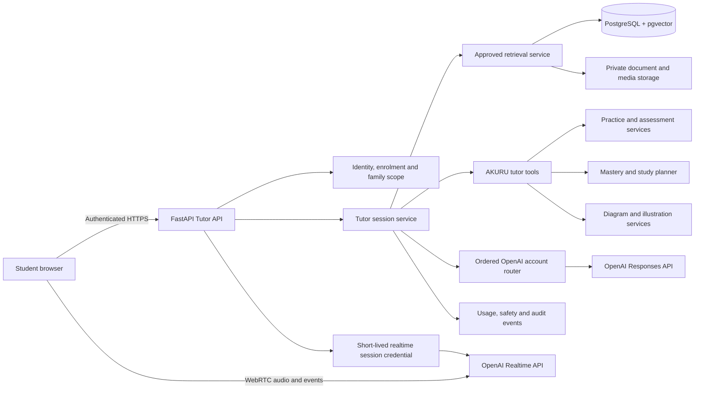

# AKURU Tutor Agent plan

Status: proposal for review. This document records the agreed product and architecture direction for a unit-scoped, configurable text and voice tutor. It does not add work to [TODO.md](../TODO.md) until the proposal is approved and divided into delivery steps.

## 1. Purpose

The AKURU Tutor Agent will help a student understand and practise a specific unit within an enrolled iGCSE subject. It will use approved AKURU learning material, adapt its explanations to the student's needs and support both text and spoken conversations.

The tutor should feel approachable and consistent without pretending to be a human. Every tutor experience must clearly identify itself as an AI tutor. A selected personality changes presentation and teaching style; it never changes facts, curriculum scope, marking rules, safeguarding rules or permissions.

The first release should make the text tutor dependable before voice and generated avatars add operational cost and complexity.

## 2. Core principles

- Keep every session inside one enrolled subject and one eligible unit unless the student explicitly starts a different session.
- Retrieve only approved, current, same-course and same-subject sources that the student is allowed to use.
- Cite the source material used in explanations so a student can open the relevant textbook page or approved reference.
- Adapt explanation depth using the student's mastery evidence, while keeping assessment marks and curriculum eligibility deterministic.
- Treat conversational observations as supporting evidence. Tutor conversation alone must not directly set or overwrite an official mastery score.
- Disable tutor hints and voice assistance during timed mocks and official paper attempts.
- Keep permanent OpenAI credentials on the backend and issue only short-lived session credentials to the browser.
- Avoid storing raw audio by default. Store the minimum transcript and learning summary required for continuity and parent oversight.
- Give parents and students clear controls for reviewing and deleting retained tutor history, subject to required audit and safeguarding retention.

## 3. Tutor profiles

A student may create more than one tutor profile, for example a calm Maths tutor and an enthusiastic French tutor. Each profile has a visible name and the following controlled properties.

| Property | Values or rule | Effect |
| --- | --- | --- |
| Presentation | Masculine, feminine or neutral | Coordinates approved avatar and voice choices without asserting a human identity |
| Avatar | Approved preset or reviewed generated image | Visual identity shown in tutor screens and voice state |
| Voice | Approved provider voice preset | Spoken output; no voice cloning or imitation of a real person |
| Tone | A small curated set such as calm, encouraging, direct or playful | Wording and conversational manner |
| Friendliness | Low, medium or high | Warmth and amount of supportive language |
| Enthusiasm | Low, medium or high | Energy of wording and delivery |
| Speed | Low, medium or high | Speech rate and conversational pacing |
| Communication character | Childlike, balanced or authoritative | Overall manner of explanation |
| Explanation depth | Concise, standard or detailed | Initial response length and worked detail |
| Teaching style | Guided, Socratic, example-led or exam-focused | Default learning interaction pattern |

The user interface should use **Childlike**, rather than “childish.” Childlike means simple, lively and curious language; the tutor must never claim to be a child. Authoritative means clear, structured and confident; it must never become intimidating, punitive or dismissive. Balanced is the recommended default.

Property combinations must be bounded by tested prompt templates. For example, low friendliness cannot produce rude language, high enthusiasm cannot distract from the lesson, and a fast voice cannot skip reasoning needed to understand an answer.

## 4. Avatar design and generation

AKURU should ship with a set of reviewed, fictional educational-hero avatar presets based on the AKURU BOT visual family. Presets are available immediately and have no generation delay or moderation workflow.

An optional avatar builder may let the student choose controlled attributes such as colour theme, clothing style, subject symbols, pose and background. The backend constructs the final image prompt from these choices. Free-form prompts should be restricted or moderated.

Generated avatars must:

- remain fictional and age-appropriate;
- avoid photorealistic children, celebrities, copyrighted superheroes and imitation of identifiable people;
- pass automated safety checks and parent or Admin review before becoming visible to a child;
- use the existing media asset and provenance system from Step 18;
- retain generation model, prompt version, moderation result, reviewer and source asset metadata;
- have a safe preset fallback when generation or review fails.

## 5. Learning modes

Each tutor session starts with a clear learning mode. The student can change mode without changing the session's subject and unit.

1. **Explain a concept** uses approved textbook material and age-appropriate examples.
2. **Ask a question** answers a student's question and checks whether the explanation was understood.
3. **Guided practice** presents eligible questions, offers staged help and explains mistakes after an attempt.
4. **Socratic practice** uses short questions and prompts so the student develops the answer.
5. **Revision** recalls key definitions, formulas, diagrams and common examiner mistakes.
6. **Exam technique** teaches command words, answer structure, time use and evidence expected by the marking scheme.
7. **Language conversation** supports approved French vocabulary, pronunciation and communication practice.

The tutor can render equations, tables, source diagrams and deterministic plots through the Step 18 media services. It may request a reviewed conceptual illustration when a visual explanation would help. Generated visuals must remain linked to their provenance and must not silently replace authoritative scientific or mathematical diagrams.

## 6. High-level architecture

FastAPI remains the authority for identity, unit eligibility, source access, practice state and retained history. The OpenAI APIs generate and understand conversation but cannot authorize resources or modify curriculum data directly.

## 7. Text tutoring flow

1. The student selects an enrolled subject, an eligible unit and a tutor profile.
2. FastAPI creates a server-owned session with an immutable snapshot of the profile version, course, subject, unit, curriculum version and prompt version.
3. The student sends a message through the authenticated Tutor API.
4. The service checks ownership, active enrolment, unit coverage, quotas and assessment restrictions.
5. AKURU retrieves approved unit sources using metadata filters before vector ranking.
6. The tutor may invoke narrowly scoped server tools for retrieval, diagrams, examples, practice or mastery summaries.
7. The Responses API returns a structured answer containing display content, citations, suggested follow-up and any proposed learning signal.
8. FastAPI validates the response, saves the permitted transcript data and returns authorized citations and media URLs.

The prompt should tell the tutor to admit when approved evidence is insufficient and to ask a focused clarifying question when the student's request is ambiguous. Uploaded source text is always untrusted content and can never override tutor or security instructions.

## 8. Voice tutoring flow

Voice should use WebRTC between the browser and the OpenAI Realtime API for low-latency speech. The browser requests a short-lived session credential from an authenticated FastAPI endpoint. The permanent provider key remains in backend configuration.

At session creation, FastAPI supplies the selected voice and bounded persona settings, unit scope, allowed tool definitions and safeguarding instructions. Tools call AKURU backend endpoints, where ordinary authentication and authorization run again. The realtime model does not receive unrestricted database or storage access.

The voice interface should provide:

- start, pause, mute and end controls;
- a visible “AKURU AI Tutor” indicator and the active subject/unit;
- live captions and a text-input fallback;
- an interrupt button so the student can speak while the tutor is talking;
- a repeat/slower control and a written explanation option;
- clear connection and account-failover states;
- automatic session termination after inactivity or quota exhaustion.

One OpenAI account is selected for an entire realtime connection. If that account becomes unavailable, AKURU ends the failed connection, selects the next healthy configured account and reconnects using the same AKURU session context. The student may notice a brief pause. The curriculum scope, profile version and saved transcript remain stable, although provider-side conversation state and prompt caching may need to be rebuilt.

## 9. Tutor tools

The model receives only task-specific tools with strict request and response schemas. Initial tools should include:

- `search_unit_sources` for approved textbook passages, examples, formulas and definitions;
- `open_source_reference` for an authorized page or crop;
- `get_unit_mastery_summary` for an explainable, student-safe mastery overview;
- `get_study_plan_item` for the current unit and scheduled goal;
- `create_guided_practice` for eligible, non-exam practice;
- `submit_practice_answer` through the existing assessment service;
- `render_equation_or_diagram` through deterministic media services;
- `request_reviewed_illustration` when an approved visual is available or can be queued;
- `record_tutor_signal` for bounded, non-authoritative learning observations.

Tools must derive the student from the authenticated session. The model cannot supply a different student ID, broaden the unit scope, fetch unapproved documents or reveal marking material during an active assessment.

## 10. Conversation memory and learning signals

Short-term context lives inside the current session. Long-term continuity should use compact, structured summaries instead of replaying every historical message. A summary may record concepts covered, practice completed, recurring confusion, stated preferences and the next suggested action.

Tutor signals may indicate that a student explained a concept correctly, repeatedly needed a hint or showed uncertainty. These are supporting observations with low evidence weight. They can suggest practice or influence study-plan priority, but only completed assessed work processed through the assessment and mastery services can make authoritative mastery changes.

Every signal records its source session, unit, timestamp, prompt/model versions and confidence. Signals must never mix siblings and must remain explainable to the student and parent.

## 11. Data model

The detailed schema should be designed during implementation. The expected domain entities are:

| Entity | Purpose and key constraints |
| --- | --- |
| `tutor_profiles` | Student-owned current profile; family-scoped and soft-deletable |
| `tutor_profile_versions` | Immutable persona settings used to reproduce historical sessions |
| `tutor_subjects` | Optional subject/unit preferences; only enrolled subjects and eligible units |
| `tutor_avatars` | Preset or generated asset, moderation/review state and media provenance |
| `tutor_voice_presets` | Admin-approved provider voices and supported presentation settings |
| `tutor_sessions` | Student, profile version, subject, unit, mode, status, usage and timestamps |
| `tutor_turns` | Retained text/caption turns, role, moderation state and provider metadata |
| `tutor_turn_sources` | Approved source chunks, pages, bounding boxes and media cited by a turn |
| `tutor_signals` | Append-only supporting learning observations with confidence and provenance |
| `tutor_safety_events` | Restricted audit events for moderation, escalation and policy actions |

Internal UUIDs stay out of normal user-facing screens and public API fields unless a non-sensitive opaque reference is required. Database constraints and service validation must enforce ownership, subject/unit consistency, unique profile versioning and valid enum values.

## 12. Proposed API surface

All routes are versioned, authenticated, rate-limited and scoped from the current principal.

### Student routes

- `GET /api/v1/tutor/options` returns allowed profile, avatar and voice choices.
- `GET|POST /api/v1/tutor/profiles` lists or creates the current student's profiles.
- `GET|PATCH|DELETE /api/v1/tutor/profiles/{profile_ref}` manages an owned profile.
- `POST /api/v1/tutor/avatars` requests a controlled generated avatar.
- `POST /api/v1/tutor/sessions` starts a unit-scoped text session.
- `GET /api/v1/tutor/sessions` lists the student's retained sessions.
- `GET|DELETE /api/v1/tutor/sessions/{session_ref}` reads or requests deletion of an owned session.
- `POST /api/v1/tutor/sessions/{session_ref}/turns` sends a text turn.
- `POST /api/v1/tutor/sessions/{session_ref}/realtime-token` creates a short-lived voice credential.
- `POST /api/v1/tutor/sessions/{session_ref}/end` closes and summarizes a session.

### Parent routes

- `GET /api/v1/parent/children/{child_ref}/tutor-summary` returns educational summaries and usage for an owned child.
- `GET /api/v1/parent/children/{child_ref}/tutor-sessions` returns the permitted history view.
- `POST /api/v1/parent/children/{child_ref}/tutor-avatars/{avatar_ref}/review` approves or rejects a generated avatar.
- `DELETE /api/v1/parent/children/{child_ref}/tutor-sessions/{session_ref}` requests deletion within retention rules.

### Admin routes

- Manage approved voice presets, avatar presets and bounded persona options.
- Review generated avatars and moderation events.
- Inspect aggregate health, latency, quota, cost and safety metrics.
- Configure age-appropriate defaults and feature flags without reading family conversations as a routine operation.

## 13. Role-specific frontend experience

### Student portal

The student sees a **My Tutors** area for choosing or building a tutor, selecting a subject/unit and starting a text or voice lesson. The session page combines conversation, citations, diagrams, practice cards, captions and voice controls. It shows the current unit and makes mode changes explicit.

### Parent portal

The parent sees tutor usage for each linked child, recent units, session summaries, generated-avatar approvals, quota controls and deletion controls. The view should focus on learning progress and safety without turning every private learning conversation into surveillance. The exact transcript visibility policy must be decided before implementation.

### Admin portal

The Admin manages approved voices and preset avatars, feature flags, quotas, provider health and content-safety queues. Admin access to an individual conversation must require a support or safeguarding reason and produce an audit event.

## 14. Safety, privacy and transparency

- Label every tutor as AI in profile creation and during sessions.
- Do not let an avatar, name or voice imply that it is a real teacher, child, celebrity or known fictional hero.
- Do not support voice cloning in this scope.
- Apply age-appropriate moderation to user input, model output and avatar generation.
- Keep tutor conversations educational and redirect inappropriate or unsafe requests using a consistent safeguarding response.
- Define when a safety event is visible to the parent and when it requires an Admin review.
- Never include family identity, email address or username in OpenAI requests when a pseudonymous reference is sufficient.
- Redact secrets and sensitive source content from application logs.
- Store no raw audio by default. If later enabled, require an explicit retention purpose, parent control, encryption and a separate deletion policy.
- Reuse Step 20 encryption, backup, audit, quota, retention and incident-response controls.

## 15. Reliability, cost and account routing

The existing ordered OpenAI account router should route text operations. Each operation preserves one logical operation ID and one validated result. Realtime voice chooses an account when establishing the connection and keeps it for that connection.

Control cost and availability through:

- per-family daily and monthly voice-minute limits;
- per-session duration and inactivity limits;
- maximum output length and tool-call count;
- text fallback when realtime voice is unavailable;
- generated-avatar quotas and reuse of approved assets;
- provider latency, error, token and audio-minute monitoring;
- a kill switch for voice or image generation without disabling text tutoring.

Account switching during text tutoring may add latency but does not change the structured request. Switching a realtime account requires reconnection and reconstructed context, so the UI must preserve the local transcript and explain the brief interruption.

## 16. Evaluation and release gates

Step 19 evaluation must be extended before the tutor is enabled for students. The evaluation set should cover every supported subject and a representative range of mastery levels.

Required gates include:

- source citation correctness and same-unit retrieval;
- factual and mathematical accuracy;
- refusal to use uncovered, unapproved or cross-subject material;
- age-appropriate language for every character/tone combination;
- persona consistency without changing the correct academic answer;
- correct tool selection and resistance to prompt injection in source text;
- no answer or hint leakage during active exam mode;
- safe handling of requests outside the educational scope;
- transcript, family-scope and deletion isolation;
- voice intelligibility, interruption, caption and reconnect behavior;
- acceptable latency, cost and failure rates;
- human review of generated-avatar safety and AKURU brand consistency.

Text and voice should have separate feature flags and release gates. A profile combination that fails a persona or safety evaluation remains unavailable even when other combinations pass.

## 17. Delivery phases

### Phase A — Profile foundation

- Add tutor profile, immutable version, preset avatar and approved voice models.
- Build Student profile creation and Parent/Admin visibility.
- Add controlled settings and validation for presentation, tone, friendliness, enthusiasm, speed, communication character, depth and teaching style.
- Use existing AKURU BOT assets for initial presets.

### Phase B — Unit-scoped text tutor

- Add session and turn models, Tutor API and Responses API orchestration.
- Integrate approved RAG, citations, equations, diagrams and mastery summaries.
- Add guided practice and tutor signals with strict assessment boundaries.
- Deliver Student conversation UI and Parent learning summaries.

### Phase C — Generated avatar builder

- Add controlled avatar attributes, generation jobs, moderation and review.
- Reuse the Step 18 private media and provenance pipeline.
- Add parent/Admin approval, quotas and safe preset fallback.

### Phase D — Realtime voice

- Add the short-lived credential endpoint and WebRTC client.
- Add captions, interruption, speed control, text fallback and session limits.
- Connect authorized backend tools and ordered-account reconnection.
- Verify no raw audio retention and document provider data handling.

### Phase E — Visual and practice tools

- Let the tutor present approved source images, deterministic diagrams and reviewed conceptual illustrations.
- Add interactive guided practice while keeping exam-mode restrictions.
- Connect supporting tutor signals to study-plan recommendations.

### Phase F — Evaluation and controlled release

- Expand automated and human evaluation datasets.
- Run security, privacy, accessibility, latency and cost gates.
- Release to Admin, then a parent-controlled pilot, then eligible students.
- Monitor outcomes and retain rollback switches for voice, generation and tutor tools.

## 18. Recommended first release

The recommended initial release includes multiple tutor profiles per student, reviewed AKURU BOT preset avatars, approved provider voices, the unit-scoped text tutor, source citations, equations and diagrams, guided practice, parent-visible educational summaries, transcript deletion controls and the required evaluation gates.

Generated avatars and realtime voice should follow after the text tutor proves its grounding, permissions and learning behavior. This order also produces the session, profile, RAG, tool, audit and UI foundations that voice will reuse.

## 19. Decisions required before converting this plan into TODO steps

1. Confirm that each student may create multiple tutor profiles.
2. Confirm the approved tone choices shown in the interface.
3. Confirm that **Balanced** is the default communication character.
4. Confirm whether a profile may be used for all subjects or is assigned to selected subjects.
5. Confirm that preset avatars are immediately available.
6. Decide whether generated avatars require Parent approval, Admin approval or both.
7. Confirm that photorealistic people, celebrity likenesses and copyrighted superhero imitation are excluded.
8. Select the approved OpenAI voices after listening tests with children and parents.
9. Confirm that no raw audio is stored.
10. Choose transcript and structured-summary retention periods.
11. Decide whether parents can see complete transcripts, summaries only or transcripts only after a stated safety/support reason.
12. Set per-family voice-minute and avatar-generation quotas.
13. Confirm that one active tutor session is restricted to one subject and one unit.
14. Confirm that tutor observations remain supporting signals and never directly set official mastery.
15. Confirm that all tutor assistance is disabled during timed mocks and official paper attempts.

Recommended defaults are: multiple profiles per student; presets available immediately; generated avatars reviewed by a parent and visible to Admin moderation; no real-person imitation; no raw audio; short-lived transcripts plus longer-lived structured learning summaries; parent-visible educational summaries; one subject and unit per session; and voice/tutor assistance disabled during timed assessment.
